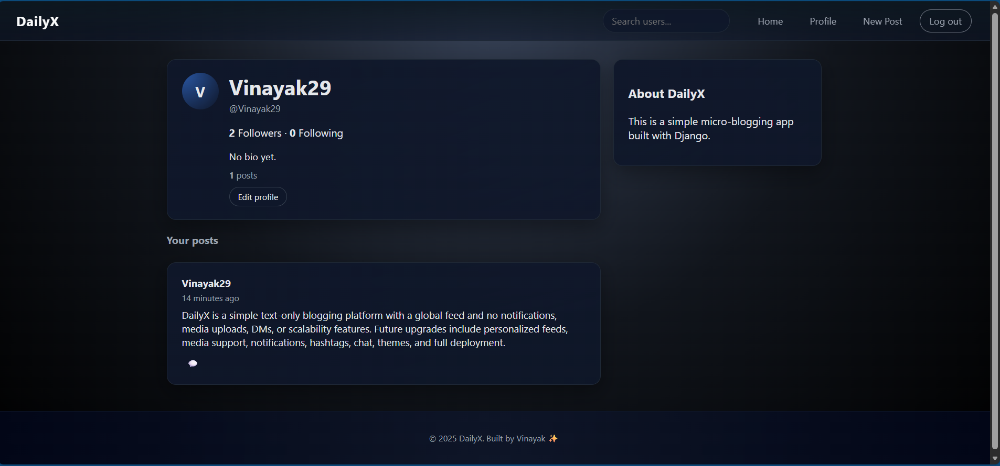

# 📝 DailyX — Microblogging Platform

A full-stack microblogging web application where users can create, share, and explore short posts — built with Django and deployed on Render.

🔗 **Live Demo**: [dailyx-microblog.onrender.com](https://dailyx-microblog.onrender.com/)

---

## ✨ Features

- 🔐 User authentication — register, login, logout
- ✍️ Create and delete short posts (microblogs)
- 📰 Real-time feed showing all posts
- 👤 User profile pages
- 📱 Responsive design for mobile and desktop
- 🛡️ CSRF protection and secure session handling

---

## 🛠️ Tech Stack

| Layer | Tech |
|---|---|
| Backend | Django (Python) |
| Frontend | HTML, CSS, JavaScript |
| Database | SQLite (dev) / PostgreSQL (prod) |
| Deployment | Render |
| Auth | Django built-in auth system |

---

## 🚀 Run Locally

```bash
# Clone the repo
git clone https://github.com/vinayak-ck/dailyx-microblog.git
cd dailyx-microblog

# Create virtual environment
python -m venv venv
source venv/bin/activate  # Windows: venv\Scripts\activate

# Install dependencies
pip install -r requirements.txt

# Apply migrations
python manage.py migrate

# Run the server
python manage.py runserver
```

Open `http://127.0.0.1:8000` in your browser.

---

## 📁 Project Structure

```
dailyx-microblog/
├── manage.py
├── requirements.txt
├── dailyx/              # Main app
│   ├── models.py        # Post model
│   ├── views.py         # Feed, create, delete views
│   ├── urls.py
│   └── templates/
└── users/               # Auth app
    ├── views.py
    └── templates/
```

---

## 📸 Screenshots

> 

---

## 📬 Contact

Built by [Vinayak Kanavalli](https://github.com/vinayak-ck) — vckanavalli@gmail.com
